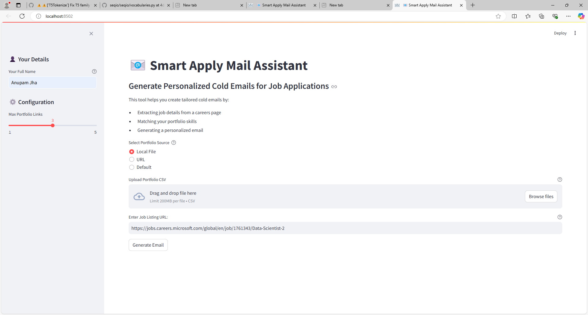
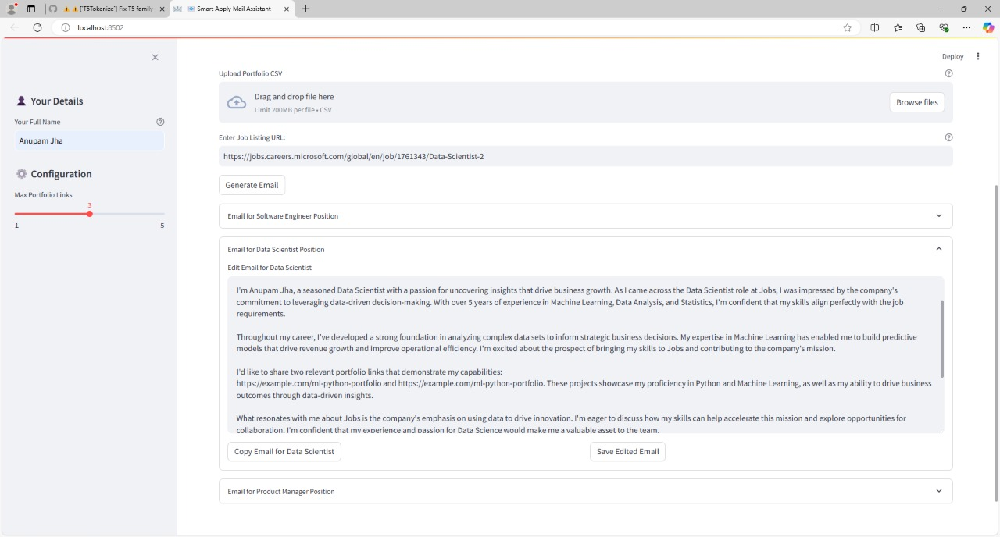

# 📧 Smart Apply Mail Assistant

## Overview
Smart Apply Mail Assistant is an AI-powered tool that helps generate personalized cold emails for job applications. It uses Groq, LangChain, and Streamlit to extract job listings and create tailored emails.

## Project Snapshots

### Job Listing Input and Portfolio Selection


### Personalized Email Generation and Editing


## Features
- 🌐 Job Listing URL Extraction
- 🤖 AI-Powered Email Generation
- 🔗 Portfolio Skill Matching
- 📤 Multiple Portfolio Sources
  - Local CSV Upload
  - URL-based CSV
  - Default Portfolio
- 🎨 Streamlit Interactive UI
- ✏️ Email Editing Capabilities

## Prerequisites
- Python 3.8+
- Groq API Key

## Setup

### 1. Clone the Repository
```bash
git clone https://github.com/yourusername/smart-apply-mail-assistant.git
cd smart-apply-mail-assistant
```

### 2. Create Virtual Environment
```bash
python -m venv job
source job/bin/activate  # On Windows use `job\Scripts\activate`
```

### 3. Install Dependencies
```bash
pip install -r requirements.txt
```

### 4. Configure Environment
1. Create a Groq account at [Groq Console](https://console.groq.com/keys)
2. Copy your API key
3. Update `app/.env` with your Groq API key:
```
GROQ_API_KEY=your_groq_api_key_here
```

### 5. Run the Application
```bash
streamlit run app/main.py
```

## Usage
- Enter a job listing URL
- Choose a portfolio source:
  1. Upload a local CSV file
  2. Provide a URL to a CSV file
  3. Use the default portfolio
- Click "Generate Email" to create personalized emails
- Edit and customize generated emails

### Portfolio CSV Format
Your portfolio CSV should have two columns:
- `Techstack`: Skills or technologies
- `Links`: Relevant project or portfolio links

### Portfolio Source Options
1. **Local File**: Upload a CSV from your computer
2. **URL**: Provide a direct link to a publicly accessible CSV
3. **Default**: Use the pre-configured portfolio

## Configuration Options
- `LOG_LEVEL`: Set logging verbosity (default: INFO)
- `MAX_PORTFOLIO_LINKS`: Limit number of portfolio links (default: 3)
- `DEFAULT_JOB_URL`: Preset job listing URL

## Contributing
1. Fork the repository
2. Create your feature branch
3. Commit your changes
4. Push to the branch
5. Create a Pull Request

## License
MIT License with Commercial Use Restrictions

## Disclaimer
This tool is for educational and professional networking purposes. Always respect the terms of service of job platforms and potential employers.
